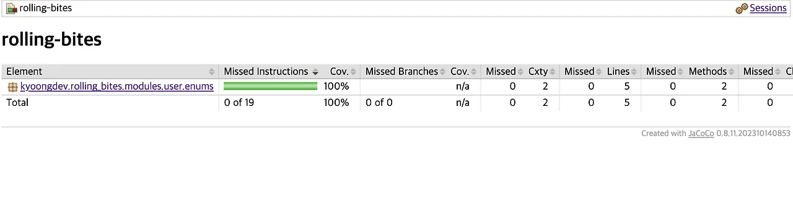
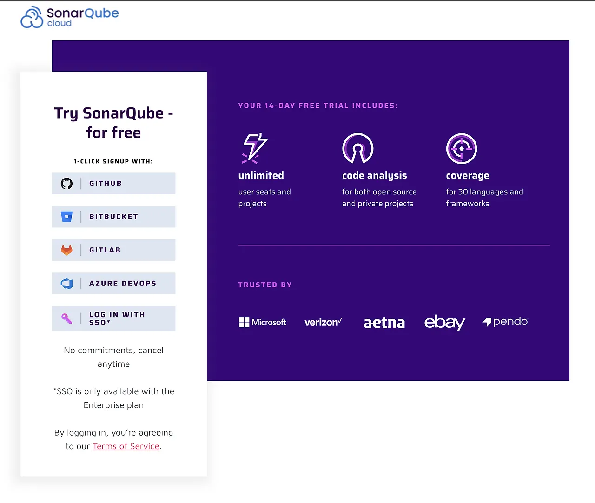
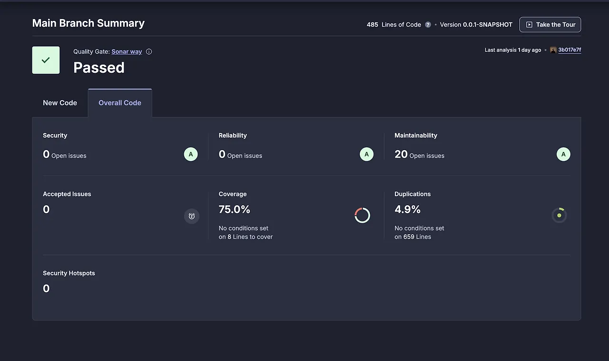

저는 어떤 언어를 사용하던지 서버 코드를 작성한다면 테스트 코드 구현은 필수라고 생각합니다. 하지만 프로젝트를 진행할 때에는 테스트 코드는 작성했으나, 정적 코드 분석을 통해 테스트 커버리지 가시화 등을 하지는 않았습니다. (반성..) 그래서 이번에는 JaCoCo와 SonarCloud를 사용해 정적 코드 분석을 해보고자 합니다.

# 1. 테스트 커버리지

본격적으로 JaCoCo와 SonarCloud를 적용하기에 테스트 커버리지가 무엇인지 알아보겠습니다.

테스트 커버리지는 작성한 코드에서 얼마나 많은 비율을 테스트 코드를 통해 검증을 했는지를 나타내는 지표입니다.

일반적으로 70~80% 이상의 커버리지를 하나의 참고 지표로 삼는 경우가 많지만, 커버리지 수치 자체가 품질을 보장하지는 않으며 중요한 비즈니스 로직에 대한 테스트 여부가 더 중요합니다.


# 2. JaCoCo

이제 그럼 JaCoCo에 대해서 알아보고 적용을 해보겠습니다.

JaCoCo는 Java 바이트코드를 기반으로 테스트 실행 시 코드 커버리지를 수집하는 Java Agent 기반 코드 커버리지 도구입니다.

  

따라서 JaCoCo를 사용하면 누구나 편하게 테스트 커버리지를 얼마나 달성했는지 확인 가능합니다.

## 2.1 JaCoCo 적용하기

적용 방벙에 대해 설명하기 이전에 실행 환경을 공유드리겠습니다.

> Java 17
> Spring Boot 3.4.2

### 2.1.1 JaCoCo 설치

우선 build.gradle에 JaCoCo를 불러온 뒤 버전을 설정합니다.

```groovy
plugins {
    id 'java'
    id 'org.springframework.boot' version '3.4.2'
    id 'io.spring.dependency-management' version '1.1.7'
    id 'jacoco'
 }

// ...

 tasks.named('test') {
    useJUnitPlatform()
    finalizedBy 'jacocoTestReport'// test가 끝나면 jacocoTestReport 실행
}

jacoco {
    toolVersion = "0.8.11"
}

jacocoTestReport {
    reports {
        html.outputLocation.set(layout.buildDirectory.dir("reports/jacoco/html"))
        xml.outputLocation.set(layout.buildDirectory.dir("reports/jacoco/jacoco.xml"))
    }
}

```

### 2.1.2 Jacoco 보고서 생성 및 커버리지 기준 설정

이후에는 JaCoCo의 보고서을 어떻게 생성할건지 그리고 커버리지 기준은 어디까지 설정할건지 적용을 해주시면 됩니다.

```groovy
jacocoTestReport {
    dependsOn test
    reports {
        html.required.set(true)
        xml.required.set(true)
        csv.required.set(true)

    }

    afterEvaluate{
        classDirectories.setFrom(
                files(classDirectories.files.collect{
                    fileTree(dir: it, excludes: ['**/dto/**',
                                                 '**/*InitData*',
                                                 '**/*Application*',
                                                 '**/exception/**',
                                                 "**/Q*"])
                })
        )
    }
    finalizedBy'jacocoTestCoverageVerification'
}

jacocoTestCoverageVerification{

    violationRules{
        rule{

            enabled= true
            element='CLASS'


            limit{
                counter='LINE'
                value='COVEREDRATIO'
                minimum= 0.80
            }


            limit{
                counter='BRANCH'
                value='COVEREDRATIO'
                minimum= 0.80
            }

            excludes = [
                "**/*Dto",
                "**/*Application",
                "**/*Exception",
                "**/Q*"
            ]

        }
    }
}
```

**jacocoTestReport** 에는 reports 를 통해 어떤 파일을 결과물로 만들지 설정하고, afterEvaluate를 통해 제외할 파일을 설정합니다. 제외할 파일의 경우 Ant 스타일로 작성하셔야합니다.

**jacocoTestCoverageVerification** 은 코드 커버리지를 만족하는지 판단하는 태스크입니다.

저의 경우에는 0.80으로 80%의 커버리지를 달성하는지 판단하도록 설정했습니다. 이때, excludes는 jacocoTestReport와 동일하게 제외할 파일이지만 여기에서는 파일 경로가 아니라 패키지 + 클래스명을 적어주어야 제대로 적용이 됩니다.

### **2.1.3 Jacoco 결과 확인**

이렇게 설정이 끝난 뒤에  `./gradlew test`  를 진행하면 **build > reports > jacoco > tests > html > index.html** 가 생성됩니다.



저 같은 경우는 아직 작성한 테스트 코드가 많이 없어 내용이 별로 없지만, 성공적으로 UI가 제작되었습니다.

## 3. SonarCloud

SonarCloud는 코드 내에서 발견되는 **코드 스멜, 잠재적 결함, 컨벤션, 보안 취약점** 등을 코드 레벨에서 분석해서 리포트를 제공하는 정적 코드 분석 Saas 서비스입니다.

Public repository에 한해 무료로 사용 가능하며, Private Repository는 유료 플랜이 필요합니다.

###**3.1 SonarCloud 가입하기

[SonarCloud 사이트](https://www.sonarsource.com/products/sonarcloud/signup/) 에 접속하면



이와 같은 화면이 나옵니다. 저는 Github를 사용할 예정이기 때문에 Github를 통해 가입을 했습니다. 기왕이면 Github를 사용하시는 걸 추천드립니다. Github Actions를 통해 다양한 테스트 환경을 구축할 수 있기 때문입니다.

회원가입을 마치시면, 사용하실 적절한 project를 선택하신 뒤에 좌측 하단의 톱니바퀴 >  Analysis Method 를 들어가시면 됩니다.

Automatic Analysis와 CI 기반 SonarScanner를 동시에 사용하면 분석 결과가 충돌하므로, GitHub Actions를 사용할 경우 Automatic Analysis를 비활성화해야 합니다.

그 다음 **With Github Actions** 를 선택한 뒤 SONAR_TOKEN을 발급받으시면 됩니다. 이 토큰은 이후 Github Actions를 적용할 때 사용하게 됩니다.

### **3.2 build.gradle에 SonarCloud 설정하기**

이후에는 프로젝트 내의 build.gradle에 SonarCloud 관련 설정을 해줘야합니다.

```groovy
plugins {
	// ...
    id 'org.sonarqube' version '4.4.1.3373'
}

// ...

sonar {
  properties {
    property "sonar.projectKey", "xxx"
    property "sonar.organization", "xxx"
    property "sonar.host.url", "https://sonarcloud.io"
    property "sonar.coverage.jacoco.xmlReportPaths",
             "build/reports/jacoco/test/jacocoTestReport.xml"
  }
}
```

project key는 SonarCloud의 프로젝트에 들어가신 뒤 URL을 확인하면 알 수 있습니다. https://sonarcloud.io/project/overview?id={project key}  에서 project key를 사용하시면 됩니다. organization은 프로젝트 생성 시에 설정한 organization을 넣어주시면 됩니다.


### **3.2 Github Actions 설정하기**

위와 같이 설정이 완료되면 이제 Gihub Actions만 설정하면 완료됩니다. 프로젝트의 루트에 .github > workflows > sonarcloud.yml을 생성하신 뒤에 다음과 같이 작성해주시면 됩니다.

```yaml
name: SonarCloud
on:
  push:
    branches: [ "dev" ]
  pull_request:
    branches: [ "dev" ]

jobs:
  build_and_analyze:
    name: Build and SonarCloud Analysis
    runs-on: ubuntu-latest

    steps:
      - name: Checkout branch
        uses: actions/checkout@v4

      - name: Load .env file
        id: load-env
        run: |
          echo "Loading .env file"
          set -o allexport
          source .env
          set +o allexport
          echo "MYSQL_ROOT_PASSWORD=$MYSQL_ROOT_PASSWORD" >> $GITHUB_ENV
          echo "MYSQL_DATABASE=$MYSQL_DATABASE" >> $GITHUB_ENV
          echo "MYSQL_USER=$MYSQL_USER" >> $GITHUB_ENV
          echo "MYSQL_PASSWORD=$MYSQL_PASSWORD" >> $GITHUB_ENV
          echo "MYSQL_PORT=$MYSQL_PORT" >> $GITHUB_ENV

      - name: Start MySQL container
        run: |
          docker run --name test-mysql \
          -e MYSQL_ROOT_PASSWORD=${{ env.MYSQL_ROOT_PASSWORD }} \
          -e MYSQL_DATABASE=${{ env.MYSQL_DATABASE }} \
          -e MYSQL_USER=${{ env.MYSQL_USER }} \
          -e MYSQL_PASSWORD=${{ env.MYSQL_PASSWORD }} \
          -p ${{ env.MYSQL_PORT }}:3306 \
          -d mysql:8.0
      - name: Set up JDK 17
        uses: actions/setup-java@v4
        with:
          java-version: '17'
          distribution: 'temurin'

      - name: Wait for MySQL to be ready
        run: |
          echo "Waiting for MySQL..."
          while ! nc -z localhost ${{ env.MYSQL_PORT }}; do
            sleep 1
          done

      - name: Cache Gradle packages
        uses: actions/cache@v4
        with:
          path: |
            ~/.gradle/caches
            ~/.gradle/wrapper
          key: ${{ runner.os }}-gradle-${{ hashFiles('**/*.gradle*', '**/gradle-wrapper.properties') }}
          restore-keys: ${{ runner.os }}-gradle

      - name: Grant execute permission for gradlew
        run: chmod +x ./gradlew

      - name: Build with Gradle
        run: ./gradlew build

      - name: Cache SonarCloud packages
        uses: actions/cache@v4
        with:
          path: ~/.sonar/cache
          key: ${{ runner.os }}-sonar
          restore-keys: ${{ runner.os }}-sonar

      - name: SonarCloud Scan
        env:
          GITHUB_TOKEN: ${{ secrets.GITHUB_TOKEN }}
          SONAR_TOKEN: ${{ secrets.SONAR_TOKEN }}
        run: ./gradlew sonar --info --stacktrace
```

저의 경우에는 CI 과정에서 테스트 실행 시 Database를 실행하기 위해서 MySQL 설정을 해두었지만, 상황에 따라 제거하셔도 됩니다.

이렇게 모든 설정이 완료되면 설정한 branch에 코드를 push하시면 정상적으로 SonarCloud가 작동합니다.



이렇게 결과를 확인하셨다면 완료하신겁니다.

---

이렇게 오늘은 jacoco와 SonarCloud를 사용해서 테스트 코드 커버리지를 가시적으로 확인하고, SonarCloud를 통해 정적 코드 분석을 해보았습니다.